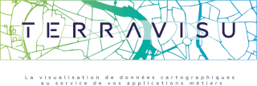
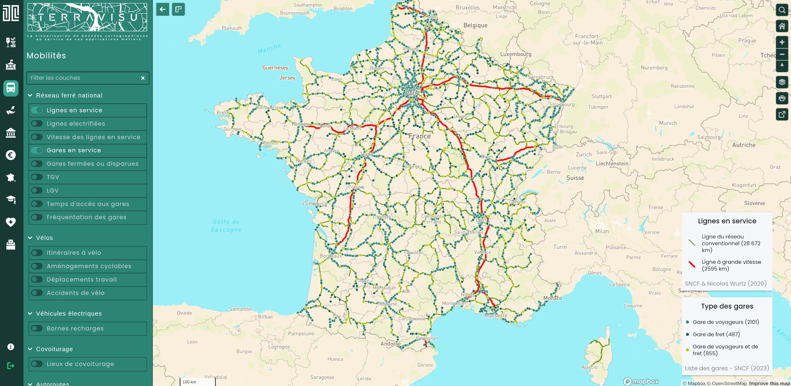
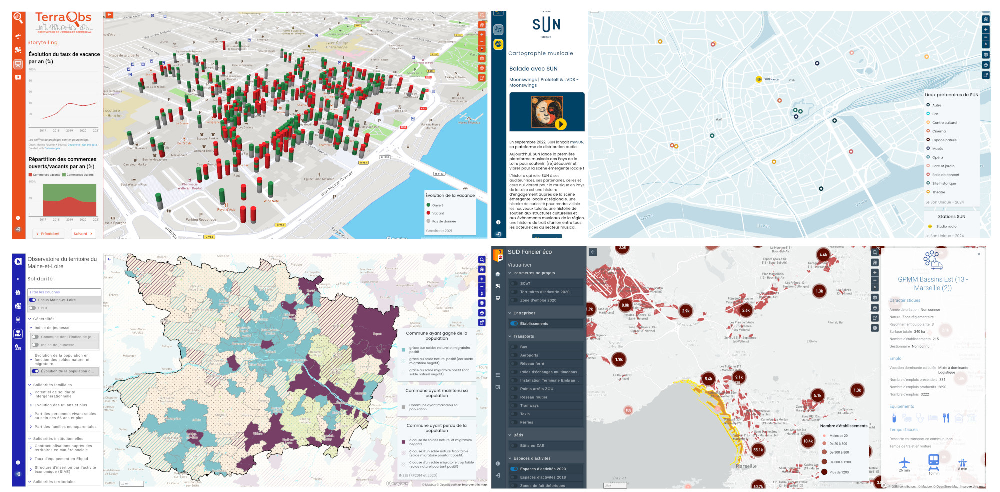

<h1 align="center">TerraVisu</h1>

    <a href="#website"><b>TerraVisu</b></a>  •  
    <a href="#features"><b>Features</b></a>  •  
    <a href="#user-manual-french"><b>User manual</b></a>  •  
    <a href="#installation-and-configuration"><b>Installation and configuration</b></a>  •   

    <a href="#support"><b>Support</b></a>  •   
    <a href="#contribution"><b>Contribution</b></a>  •  
    <a href="#thanks-to-all-contributors-"><b>Contributors</b></a>  •  
    <a href="#license"><b>License</b></a>  • 

## TerraVisu

TerraVisu is an interactive web application designed to visualize and analyze spatial data, providing an engaging interface to showcase and explore territorial dynamics and immersive experiences.

You can explore TerraVisu in action through the [demonstration website](https://demo-terravisu-territoires.makina-corpus.com).

TerraVisu is built on a modern, modular architecture that leverages React for dynamic interfaces and NextJS for server-side rendering (SSR) and search engine optimization (SEO). 

### Examples of TerraVisu portals

- Real-time commercial real estate mapping application: [TerraObs](https://demo-terraobs-territoires.makina-corpus.com/)  
- Observe, analyze, and understand territorial dynamics: [Observatoire Maine-et-Loire](https://observatoire.maine-et-loire.fr/)  
- An immersive approach where sound and geography blend to offer a new way to travel: [Le Son Unique](https://terravisu-lesonunique.makina-corpus.net/)  
- The economic land-use observatory in the PACA region: [Sud Foncier Éco](https://visu.sud-foncier-eco.fr/)  

## Features  

Explore TerraVisu's powerful features, designed to enhance spatial data visualization, territorial analysis, and immersive experiences through an intuitive and configurable interface:  

- **Interactive and dynamic mapping** for real-time spatial data visualization  
- **Customizable modules** for specific use cases, such as real estate, territorial analysis, or immersive experiences  
- **Responsive web application** with seamless navigation on desktop and mobile devices  
- **Advanced search tools** with multi-criteria filtering and data exploration  
- **Layer management** for toggling and organizing map data based on zoom levels and themes  
- **Detailed dashboards** for data insights and analysis  
- **Configuration flexibility** for adapting visuals, themes, and functionality to user needs  
- **SEO-friendly architecture** with server-side rendering for better discoverability  
- **Documentation** to support both users and administrators

## User manual (french)

- [User guide](https://terravisu.readthedocs.io/en/stable/user_manual/user_guide.html)
- [Admin guide](https://terravisu.readthedocs.io/en/stable/user_manual/admin_user_guide.html)
- [Configuration guide](https://terravisu.readthedocs.io/en/stable/user_manual/module_configuration.html)

## Installation and configuration

- [Installation](https://terravisu.readthedocs.io/en/stable/installation_configuration/install.html)
- [Configuration](https://terravisu.readthedocs.io/en/stable/installation_configuration/configuration.html)

## Support

To report bugs or suggest features, please [submit a ticket](https://github.com/Terralego/TerraVisu/issues).

## Contribution

Interested in contributing? See our [Contributing Guide](https://terravisu.readthedocs.io/en/stable/contribute/contributing.html). You can help in many ways, the ability to code is not necessary.

## Thanks to all contributors ❤

Made with [contrib.rocks](https://contrib.rocks).

## License

This project is under the MIT License. See the [LICENSE](https://github.com/Terralego/TerraVisu/blob/master/LICENSE) for details.

