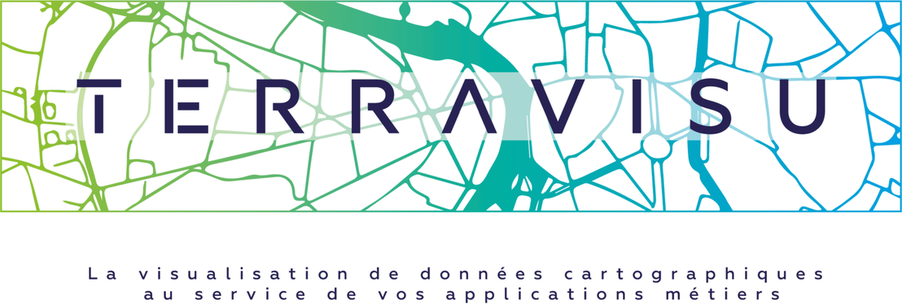

TerraVisu - Documentation
=========================

.. raw:: html

   
A mapping platform to explore, analyze and share your territorial data.

.. raw:: html

   

     <a href="user_manual/user_guide.html" style="margin:0 .4rem;">🚀 Get Started (fr)</a> ·
     <a href="installation_configuration/install.html" style="margin:0 .4rem;">🔧 Install</a> ·
     <a href="contribute/contributing.html" style="margin:0 .4rem;">✨ Contribute</a>
   

.. toctree::
   :maxdepth: 2
   :hidden:
   :caption: 🚀 User Guide

   user_manual/user_guide.rst
   user_manual/admin_user_guide.rst
   user_manual/module_configuration.rst
   user_manual/module_sheet.rst

.. toctree::
   :maxdepth: 2
   :hidden:
   :caption: 🔧 Installation & Configuration

   installation_configuration/install.rst
   installation_configuration/configuration.rst
   installation_configuration/troubleshooting.rst

.. toctree::
   :maxdepth: 2
   :hidden:
   :caption: ✨ Contribute

   contribute/contributing.rst
   contribute/development.rst
   contribute/translating.rst
   contribute/documentation.rst
   contribute/design.rst

.. toctree::
   :maxdepth: 1
   :hidden:
   :caption: 📝 Others

   others/authors.rst
   others/changelog.rst

🚀 Getting Started (fr)
------------------------

- :doc:`Discover the TerraVisu platform <user_manual/user_guide>`
- :doc:`First steps with the admin interface <user_manual/admin_user_guide>`
- :doc:`Customize your modules <user_manual/module_configuration>`
- :doc:`Explore detailed sheets <user_manual/module_sheet>`

🔧 Install & Configure
------------------------

- :doc:`Requirements & installation guide <installation_configuration/install>`
- :doc:`Configuration and environment variables <installation_configuration/configuration>`
- :doc:`Troubleshooting common issues <installation_configuration/troubleshooting>`

✨ Contribute
---------------

- :doc:`How to contribute <contribute/contributing>`
- :doc:`Development: commands and best practices <contribute/development>`
- :doc:`Translate the documentation <contribute/translating>`
- :doc:`Write and publish the documentation <contribute/documentation>`
- :doc:`Design & architecture overview <contribute/design>`

📝 Resources
--------------

- :doc:`Authors <others/authors>`
- :doc:`Changelog <others/changelog>`

