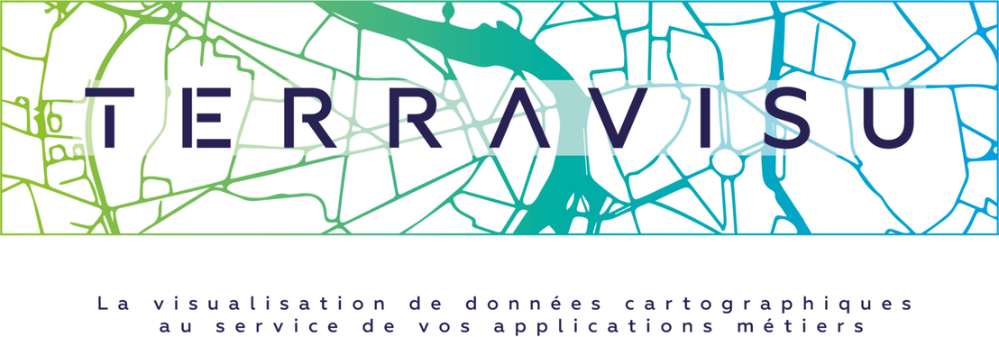

.. TerraVisu documentation master file, created by
   sphinx-quickstart on Thu Dec  8 09:39:04 2022.
   You can adapt this file completely to your liking, but it should at least
   contain the root `toctree` directive.

Welcome to TerraVisu's documentation!
=====================================

.. toctree::
   :maxdepth: 2
   :hidden:
   :caption: 🚀 User manual

   user_manual/user_guide.rst
   user_manual/admin_user_guide.rst
   user_manual/module_configuration.rst

.. toctree::
   :maxdepth: 2
   :hidden:
   :caption: 🔧 Installation & Configuration

   installation_configuration/install.rst
   installation_configuration/configuration.rst
   installation_configuration/troubleshooting.rst   

.. toctree::
   :maxdepth: 2
   :hidden:
   :caption: ✨ Contribute

   contribute/contributing.rst
   contribute/development.rst
   contribute/translating.rst
   contribute/documentation.rst
   contribute/design.rst

.. toctree::
   :maxdepth: 2
   :hidden:
   :caption: 📝 Others

   others/authors.rst
   others/changelog.rst   

🚀 User Manual
---------------

We have a few places for you to get started:

`Plateforme TerraVisu <user_manual/user_guide.html>`_
  Discover everything you need to know about TerraVisu.

`Outil d'administration <user_manual/admin_user_guide.html>`_
  Using the back-office for the first time? We have the manual to get you started.

`Module de configuration <user_manual/module_configuration.html>`_
  Want to customize TerraVisu to your needs? The configuration guide shows you how.

🔧 Installation & Configuration
---------------------------------

Need to know how something works? Here are a few of the most important reference docs:

`Install instruction <installation_configuration/install.html>`_
  Learn about the requirements and install instructions.

`Configuration <installation_configuration/configuration.html>`_
  Learn how to set your environment variables.

`Troubleshooting <installation_configuration/troubleshooting.html>`_
  Learn how to fix common problems.

✨  Contribute
---------------

Need to get something specific done? These guides provide step-by-step instructions in key areas to get you up to speed faster:

`Contributing <contribute/contributing.html>`_
  Discover how to contribute to this project.

`Development <contribute/development.html>`_
  Overview of all the main commands of developement.

`Translating <contribute/translating.html>`_
  Feel free to translate our doc.

`Documentation <contribute/documentation.html>`_
  Get familiar with some of the more advanced topics of building and deploying documentation with Read the Docs.

`Design <contribute/design.html>`_
  Information about the architecture and main components

📝 Others
----------

Learn about the authors and browse the changelog:

`Authors <others/authors.html>`_
  Learn more about the authors.

`Changelog <others/changelog.html>`_
  Overview of all notable changes made to the project. 

Indices and tables
==================

* :ref:`genindex`
* :ref:`modindex`
* :ref:`search`
