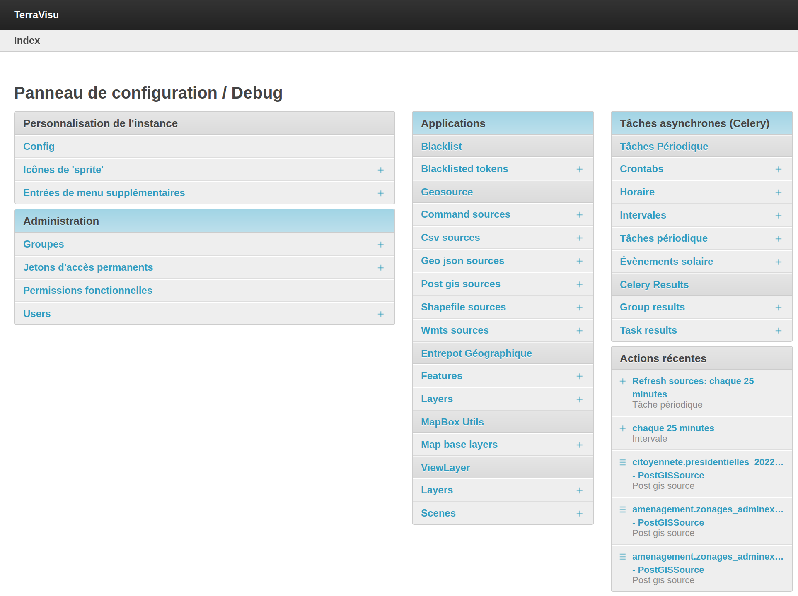

=====================
Configuration Django
=====================

Le chemin d’accès à l’interface d'administration Django est toujours constitué de l’URL du visualiseur suivis de ``/config``.

--------------------------
Panneau de configuration
--------------------------

   Panneau de configuration / Debug

--------------------------
Options de configuration
--------------------------

L'entrée ``Config`` dans le panneau de configuration offre le moyen à l'utilisateur de spécifier finement certains paramètres, activer des outils supplémentaires, personnaliser le thème de l'application, etc.

Constance
----------

Frontend options
~~~~~~~~~~~~~~~~

Options permettant d'activier ou paramétrer des fonctionnalités supplémentaires dans l'application.

- ``VIEW_ROOT_PATH`` : Chemin de la vue racine de l'application
    - Exemple : view 
- ``OPENID_SSO_LOGIN_BUTTON_TEXT`` : Texte du bouton de connexion pour OpenID
    - Exemple : Connexion CD49
- ``OPENID_DEFAULT_LOGIN_BUTTON_TEXT`` : Texte par défaut du bouton de connexion
    - Exemple : Autre utilisateur
- ``MEASURE_CONTROL`` : Option pour activer lecontrôle MapBox des mesures sur la carte
- ``MEASURE_DRAW_STYLES`` : Personnalisation du style pour le contrôle des mesures sur la carte
    - Exemple : 
- ``SEARCH_IN_LOCATIONS`` : Option pour activer la recherche par lieux sur la carte
- ``SEARCH_IN_LOCATIONS_PROVIDER`` : Fournisseur de recherche par lieu (Nominatim uniquement)
- ``NOMINATIM_URL`` : URL de recherche du service Nominatim (https://nominatim.openstreetmap.org/search.php)
- ``NOMINATIM_USE_VIEWBOX`` : Option 'viewbox' de Nominatim pour filtrer les résultats
- ``NOMINATIM_VIEWBOX_MIN_LAT`` : Latitude minimum pour l'option 'viewbox' de Nominatim
- ``NOMINATIM_VIEWBOX_MIN_LONG`` : Longitude minimum pour l'option 'viewbox' de Nominatim
- ``NOMINATIM_VIEWBOX_MAX_LAT`` : Latitude maximum pour l'option 'viewbox' de Nominatim
- ``NOMINATIM_VIEWBOX_MAX_LONG`` : Longitude maximum pour l'option 'viewbox' de Nominatim

General options
~~~~~~~~~~~~~~~~

- ``INSTANCE_TITLE`` : Titre de l'instance
    - Exemple : Observatoire du territoire du Maine-et-Loire

Map BBOX options
~~~~~~~~~~~~~~~~

Ces paramètres permettent de limiter l'étendue de la recherche si les options ``NOMINATIM_VIEWBOX_`` ne sont pas renseignées.

- ``MAP_BBOX_LNG_MIN`` : Longitude minimum de la BBox de la carte
- ``MAP_BBOX_LNG_MAX`` : Longitude maximum de la BBox de la carte
- ``MAP_BBOX_LAT_MIN`` : Latitude minimum de la BBox de la carte
- ``MAP_BBOX_LAT_MAX`` : Latitude maximum de la BBox de la carte

Map Zoom options
~~~~~~~~~~~~~~~~

Ces paramètres permettent de spécifier un niveau minimal et maximal entre lesquels il sera possible de naviguer sur la carte.

- ``MAP_MAX_ZOOM`` : Zoom maximum de la carte
- ``MAP_MIN_ZOOM`` : Zoom minimum de la carte

Map default options
~~~~~~~~~~~~~~~~~~~

Ces paramètres permettent de définir l'emprise spatiale de l'application.
Cette emprise pourra être redéfinie au niveau de chaque vue dans l'outil d'administration (se référer à la section :ref:`Créer une vue <creer-une-vue>`).

- ``MAP_DEFAULT_ZOOM`` : Zoom par défaut de la carte
- ``MAP_DEFAULT_LNG`` : Longitude par défaut du centre de la carte
- ``MAP_DEFAULT_LAT`` : Latitude par défaut du centre de la carte

Mapbox options
~~~~~~~~~~~~~~

La clé Mapbox est obligatoire pour l'affichage de la carte.

- ``MAPBOX_ACCESS_TOKEN`` : Clé Mapbox

Theme Options
~~~~~~~~~~~~~~

Options de personnalisation du thème de l'application.

- ``INSTANCE_LOGO`` : Logo affiché en haut à gauche du menu des vues
- ``INSTANCE_LOGO_FRONTEND_URL`` : URL du logo de l'application
- ``INSTANCE_FAVICON`` : Favicon
- ``INSTANCE_SPLASHSCREEN`` : Logo de démarrage (non fonctionnel)
- ``INSTANCE_CREDITS`` : Crédits de l'instance, s'affiche sur la carte en mode impression
- ``INSTANCE_INFO_CONTENT`` : Contenu de l'onglet 'Informations' de l'application
    

