========================
Module de configuration
========================

Le module de configuration est accessible via l’URL du visualiseur, suivie de ``/config``.

Depuis le bandeau supérieur (header), il est possible de naviguer entre les interfaces :

- le bouton **« ADMIN »** permet de revenir à l’outil d’administration ;
- le bouton **« VOIR LE SITE »** permet de retourner au visualiseur.

Le bouton **« DEBUG »** donne accès à une interface avancée du module d’administration.  
Elle permet notamment de gérer les tâches Celery, les sources TerraVisu, les tâches périodiques ainsi que les utilisateurs.

Cette interface est destinée aux administrateurs.

Panneau de configuration
=========================

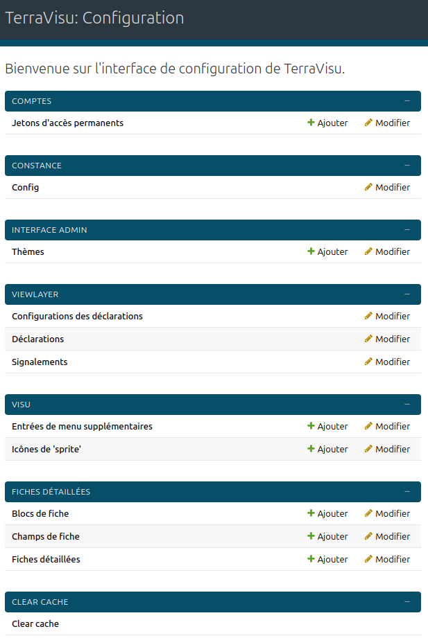

   Panneau de configuration

Options de configuration
-------------------------

L'entrée ``Config`` dans la section CONSTANCE du panneau de configuration offre le moyen à l'utilisateur de spécifier finement certains paramètres, activer des outils supplémentaires, personnaliser le thème de l'application, etc.

Les paramètres généraux de configuration de l'application se trouve dans la section ``/config/constance/config/``.

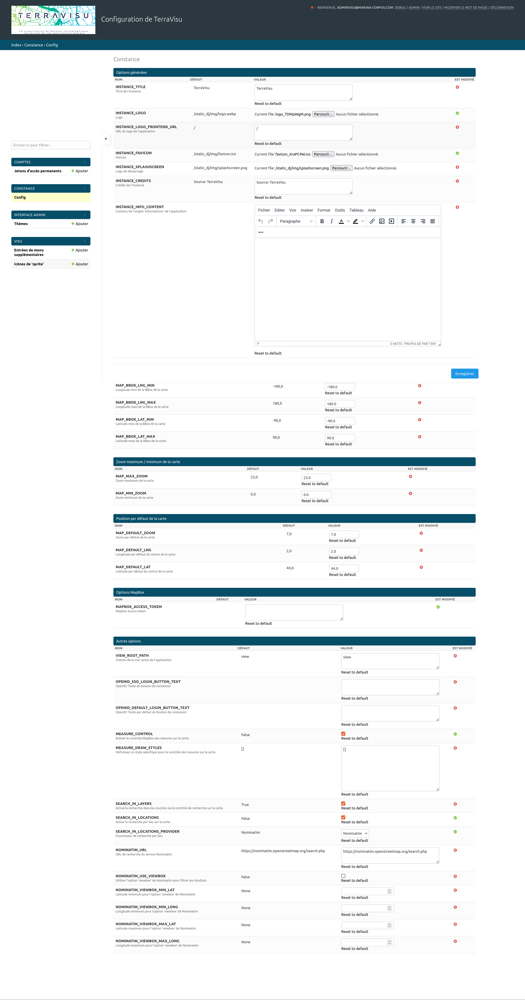

   Page de configuration

Frontend options
~~~~~~~~~~~~~~~~~~

Options permettant d'activier ou paramétrer des fonctionnalités supplémentaires dans l'application.

- ``VIEW_ROOT_PATH`` : Chemin de la vue racine de l'application
    - Exemple : view 
- ``OPENID_SSO_LOGIN_BUTTON_TEXT`` : Texte du bouton de connexion pour OpenID
    - Exemple : Connexion CD49
- ``OPENID_DEFAULT_LOGIN_BUTTON_TEXT`` : Texte par défaut du bouton de connexion
    - Exemple : Autre utilisateur
- ``MEASURE_CONTROL`` : Option pour activer lecontrôle MapBox des mesures sur la carte
- ``MEASURE_DRAW_STYLES`` : Personnalisation du style pour le contrôle des mesures sur la carte
    - Exemple : 
- ``SEARCH_IN_LOCATIONS`` : Option pour activer la recherche par lieux sur la carte
- ``SEARCH_IN_LOCATIONS_PROVIDER`` : Fournisseur de recherche par lieu (Nominatim uniquement)
- ``NOMINATIM_URL`` : URL de recherche du service Nominatim (https://nominatim.openstreetmap.org/search.php)
- ``NOMINATIM_USE_VIEWBOX`` : Option 'viewbox' de Nominatim pour filtrer les résultats
- ``NOMINATIM_VIEWBOX_MIN_LAT`` : Latitude minimum pour l'option 'viewbox' de Nominatim
- ``NOMINATIM_VIEWBOX_MIN_LONG`` : Longitude minimum pour l'option 'viewbox' de Nominatim
- ``NOMINATIM_VIEWBOX_MAX_LAT`` : Latitude maximum pour l'option 'viewbox' de Nominatim
- ``NOMINATIM_VIEWBOX_MAX_LONG`` : Longitude maximum pour l'option 'viewbox' de Nominatim

General options
~~~~~~~~~~~~~~~~~~

- ``INSTANCE_TITLE`` : Titre de l'instance
    - Exemple : Observatoire du territoire du Maine-et-Loire

Map BBOX options
~~~~~~~~~~~~~~~~~~

Ces paramètres permettent de limiter l'étendue de la recherche si les options ``NOMINATIM_VIEWBOX_`` ne sont pas renseignées.

- ``MAP_BBOX_LNG_MIN`` : Longitude minimum de la BBox de la carte
- ``MAP_BBOX_LNG_MAX`` : Longitude maximum de la BBox de la carte
- ``MAP_BBOX_LAT_MIN`` : Latitude minimum de la BBox de la carte
- ``MAP_BBOX_LAT_MAX`` : Latitude maximum de la BBox de la carte

Map Zoom options
~~~~~~~~~~~~~~~~~~

Ces paramètres permettent de spécifier un niveau minimal et maximal entre lesquels il sera possible de naviguer sur la carte.

- ``MAP_MAX_ZOOM`` : Zoom maximum de la carte
- ``MAP_MIN_ZOOM`` : Zoom minimum de la carte

Map default options
~~~~~~~~~~~~~~~~~~~~~

Ces paramètres permettent de définir l'emprise spatiale de l'application.
Cette emprise pourra être redéfinie au niveau de chaque vue dans l'outil d'administration (se référer à la section :ref:`Créer une vue <creer-une-vue>`).

- ``MAP_DEFAULT_ZOOM`` : Zoom par défaut de la carte
- ``MAP_DEFAULT_LNG`` : Longitude par défaut du centre de la carte
- ``MAP_DEFAULT_LAT`` : Latitude par défaut du centre de la carte

Mapbox options
~~~~~~~~~~~~~~~~~~

La clé Mapbox est obligatoire pour l'affichage des cartes de définition de l'empriqse spatiale dans l'outil d'administration.

- ``MAPBOX_ACCESS_TOKEN`` : Clé Mapbox

Theme Options
~~~~~~~~~~~~~~~~~~

Options de personnalisation du thème de l'application.

- ``INSTANCE_LOGO`` : Logo affiché en haut à gauche du menu des vues
- ``INSTANCE_LOGO_FRONTEND_URL`` : URL du logo de l'application
- ``INSTANCE_FAVICON`` : Favicon
- ``INSTANCE_SPLASHSCREEN_ENABLED`` : Active le logo de démarrage
- ``INSTANCE_SPLASHSCREEN`` : Logo de démarrage
- ``INSTANCE_CREDITS`` : Crédits de l'instance, s'affiche sur la carte en mode impression
- ``INSTANCE_INFO_CONTENT`` : Contenu de l'onglet 'Informations' de l'application
- ``INSTANCE_LOGIN_MESSAGE`` : Message à afficher avec le formulaire de connexion 
- ``REPORT_MAIL_SIGNATURE`` : Signature insérée à la fin des e-mails de notification concernant les Signalements et Déclarations
	

Viewlayer
---------------

Configurations des déclarations
~~~~~~~~~~~~~~~~~~~~~~~~~~~~~~~~

Cette entrée permet de configurer le formulaire affiché dans le visualiseur.

Le formulaire est accessible via le bouton **« Déclarations »**, situé dans les contrôles de la carte. Lorsqu’un utilisateur clique sur ce bouton puis sur la carte, le formulaire se déploie.

Il est possible d’y ajouter des champs de saisie ainsi qu’un texte explicatif pour guider l’utilisateur.

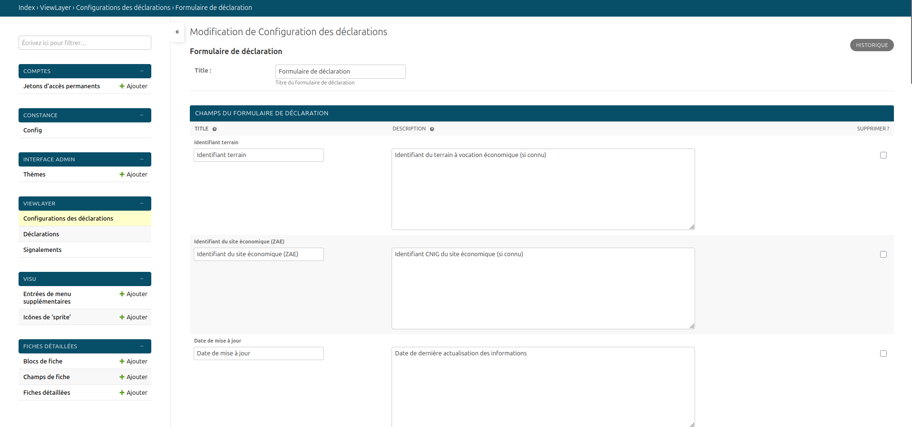

   Configuration du formulaire de déclarations

Déclarations
~~~~~~~~~~~~~

Lorsqu’un formulaire de déclaration est complété puis soumis depuis le visualiseur, une nouvelle entrée est créée dans la liste accessible à l’adresse ``/config/terra_layer/declaration/``.

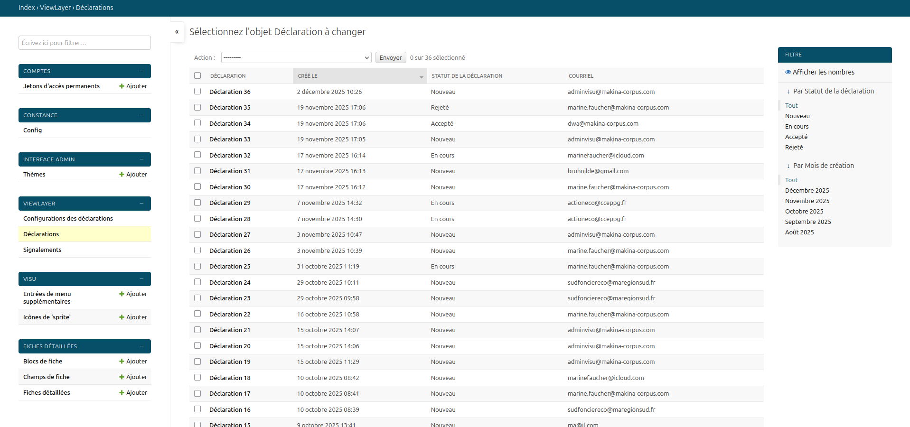

   Liste des déclarations réalisées

Pour consulter le détail d’une déclaration, cliquez sur son nom dans la colonne **« Déclaration »**.

Il est possible de modifier le statut d’une déclaration (**Nouveau**, **En cours**, **Accepté**, **Rejeté**) et d’y associer un message.

Lors d’un changement de statut, l’auteur de la déclaration reçoit un e-mail l’informant de la prise en charge de sa demande.

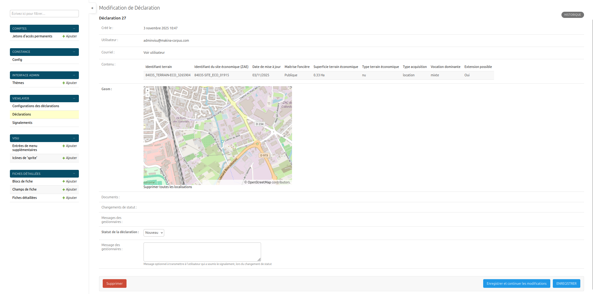

   Détail d'une déclaration

Signalements
~~~~~~~~~~~~~~

Lorsqu’un formulaire de signalement est complété puis soumis depuis le visualiseur, une nouvelle entrée est créée dans la liste accessible à l’adresse ``/config/terra_layer/report/``.

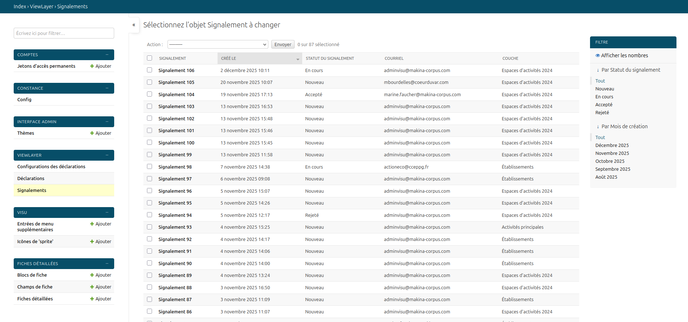

   Liste des signalements réalisés

Pour consulter le détail d’une déclaration, cliquez sur son nom dans la colonne **« Signalement »**.

Il est possible de modifier le statut d’un signalement (**Nouveau**, **En cours**, **Accepté**, **Rejeté**) et d’y associer un message.

Lors d’un changement de statut, l’auteur du signalement reçoit un e-mail l’informant de la prise en charge de sa demande.

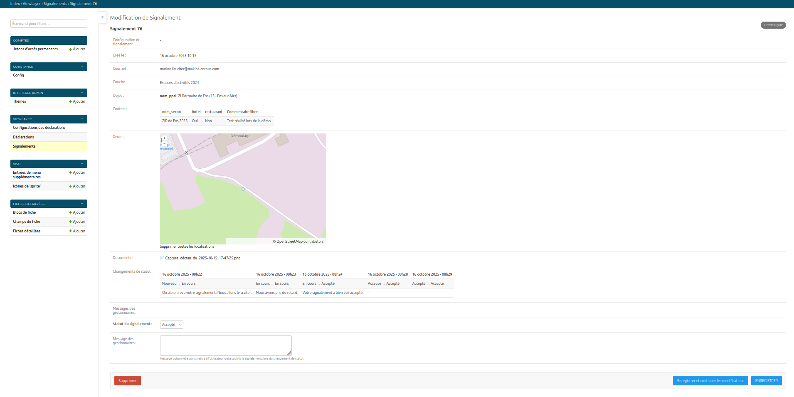

   Détail d'un signalement

Visu
-------

Entrée de menus supplémentaires
~~~~~~~~~~~~~~~~~~~~~~~~~~~~~~~~~

Il est possible de définir une ou plusieurs entrées de menu supplémentaires, affichées dans le panneau latéral gauche du visualiseur.

Pour créer une nouvelle entrée, rendez-vous à l’adresse ``/config/visu/extramenuitem/``.

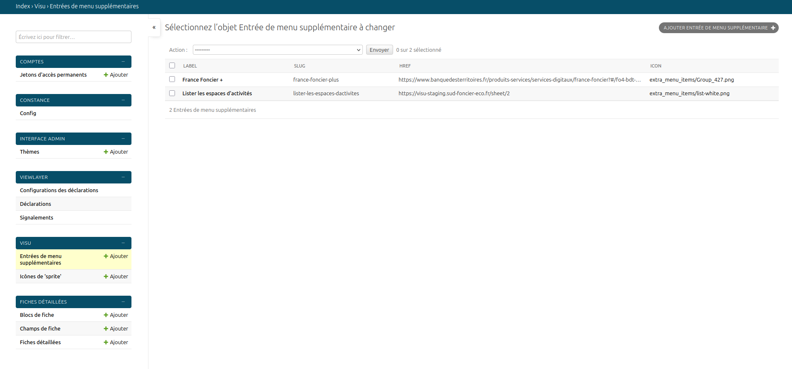

   Liste des menus supplémentaires

Il est également possible de restreindre l’accès à ces menus à certains groupes d’utilisateurs.

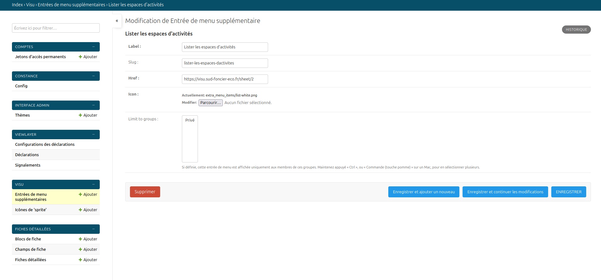

   Détail d'une entrée de menu supplémentaire

Fiches détaillées
-------------------

Le module de fiches détaillées permet de créer des fiches enrichies, intégrant différents types de contenus : graphiques, textes, tableaux, pictogrammes, etc.

Ces fiches apportent une réelle valeur ajoutée aux données sources en les structurant, en les mettant en forme et en les rendant plus accessibles.

La configuration se déroule en trois étapes :

- créer une fiche
- définir les champs associés
- ajouter et organiser les blocs de contenu

Fiches détaillées
~~~~~~~~~~~~~~~~~~~~

La sous-section **Fiches détaillées** permet de déclarer une nouvelle fiche.

Pour cela, il est nécessaire de renseigner :

- son nom 
- un identifiant unique à utiliser 
- la ou les sources associées (qui doivent partager ce même identifiant)

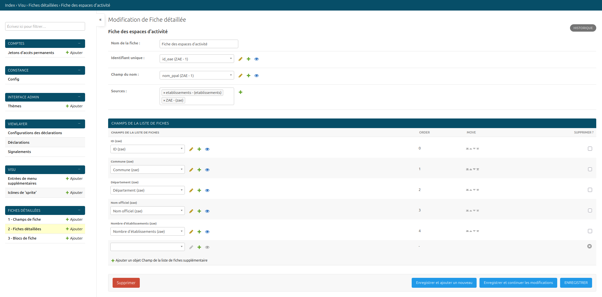

   Modification de fiche détaillée

Cette section permet également de définir les champs qui seront affichés dans la liste des fiches sur le site.

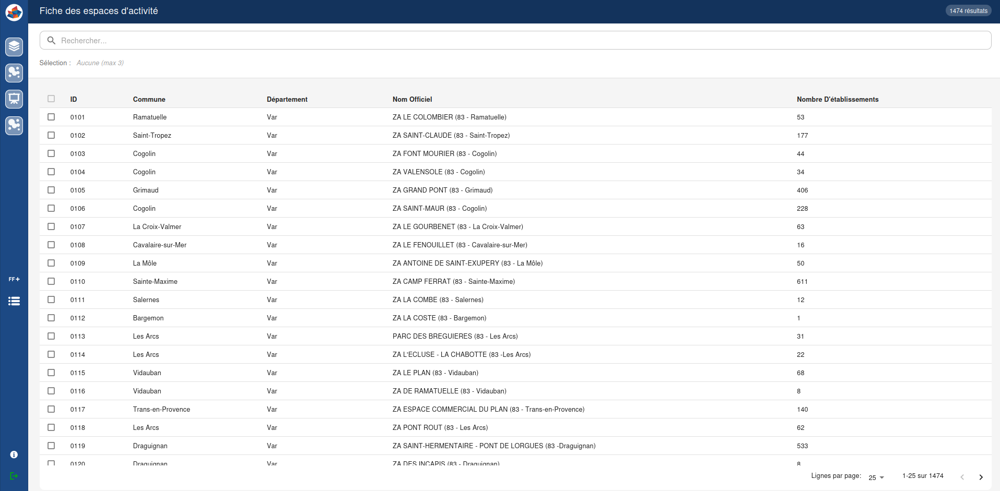

   Liste des fiches détaillées

Champs de fiche
~~~~~~~~~~~~~~~~~~~~

Plusieurs types de champs sont disponibles :

- **booléen** : avec possibilité d’associer des pictogrammes 
- **textuel** 
- **numérique** : avec possibilité de définir un suffixe et le nombre de décimales

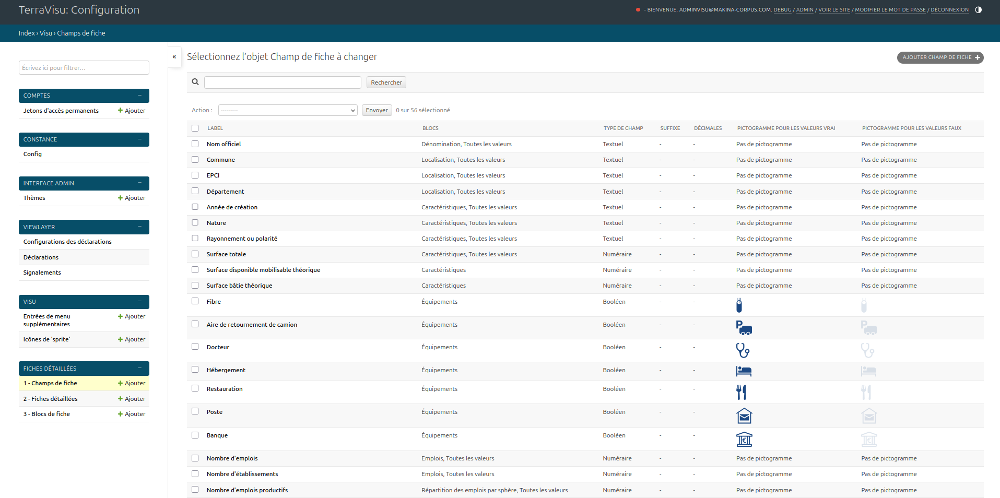

   Liste des champs de fiche

Blocs de fiche
~~~~~~~~~~~~~~~~~~~~

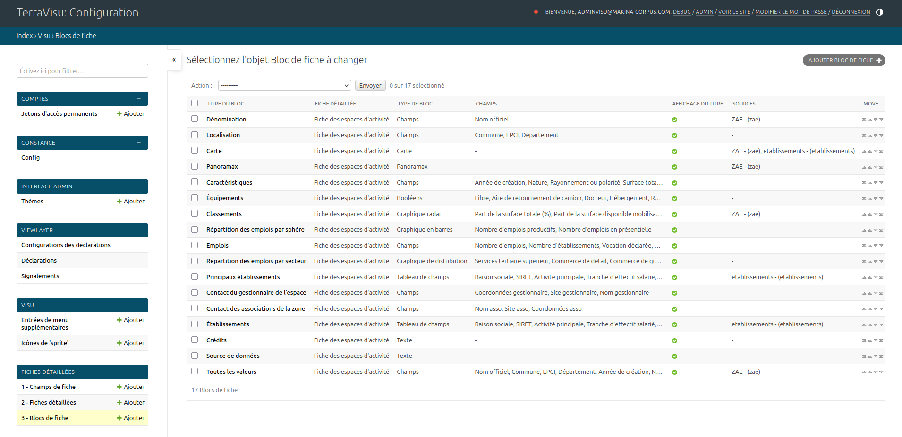

   Liste des blocs de fiche

Champs
^^^^^^

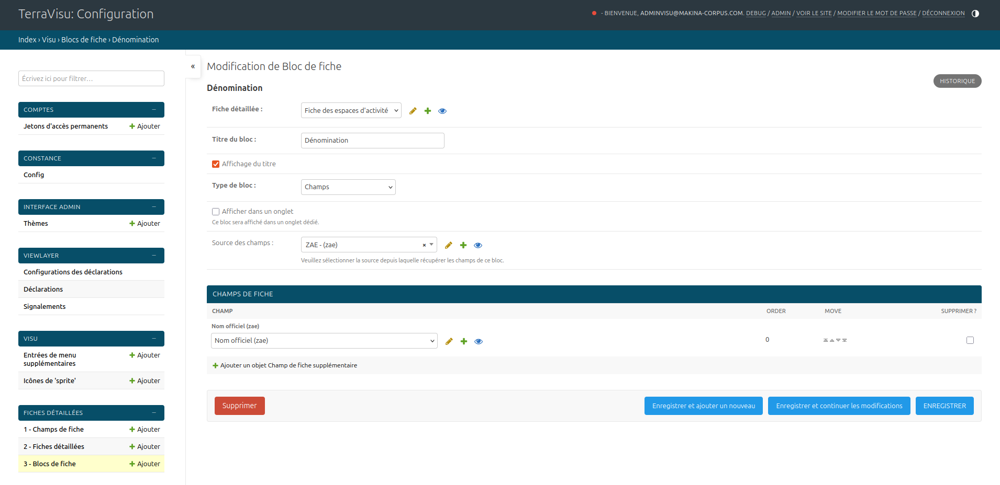

   Édition d'un bloc de type "Champs"

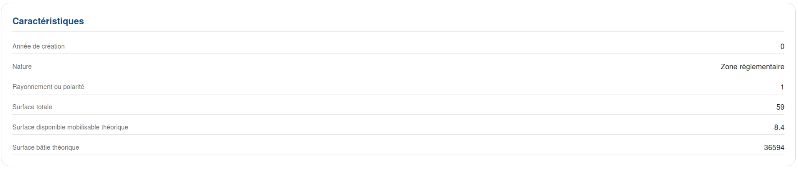

   Rendu du bloc de type "Champs"

Carte
^^^^^^

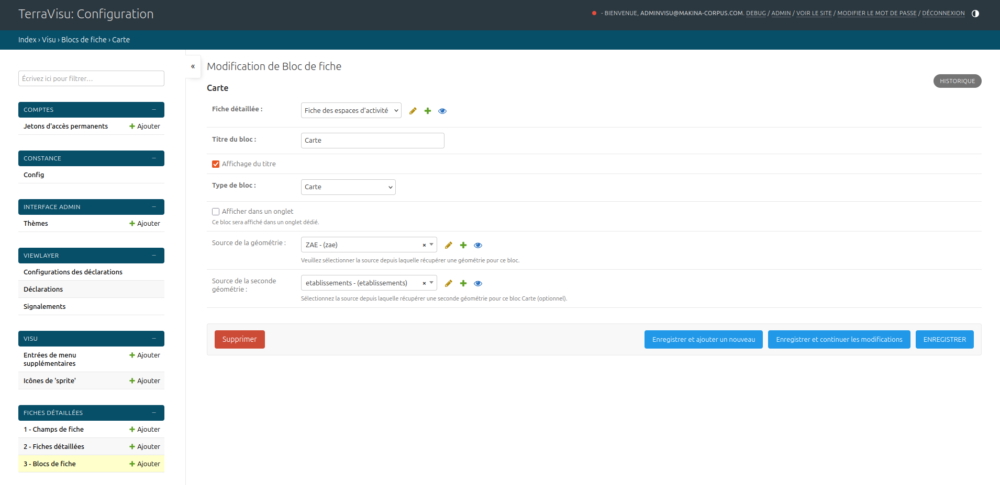

   Édition d'un bloc de type "Carte"

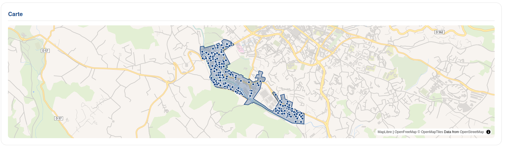

   Rendu du bloc de type "Carte"

Panoramax
^^^^^^^^^^

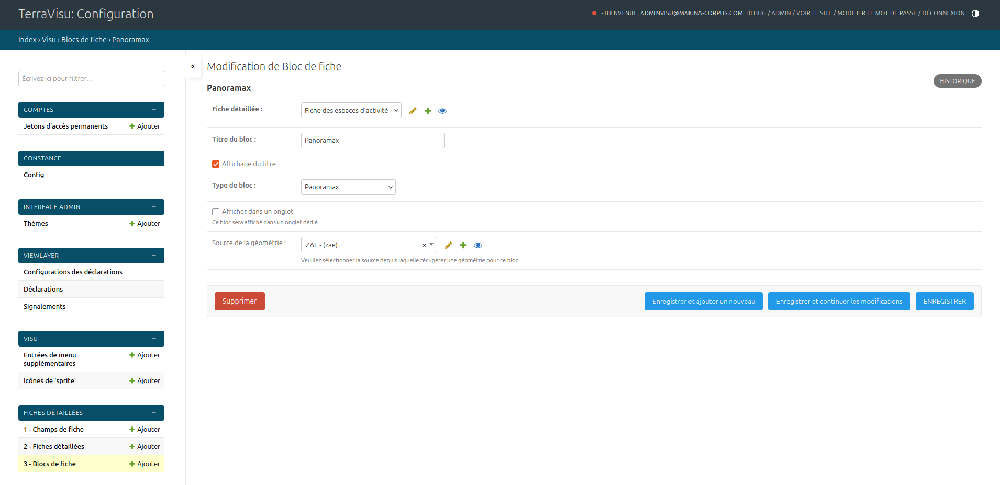

   Édition d'un bloc de type "Panoramax"

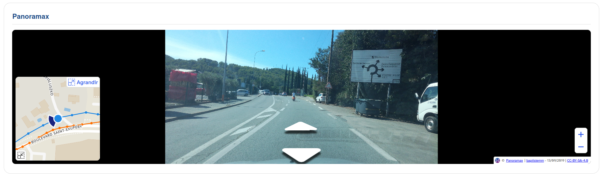

   Rendu du bloc de type "Panoramax"

Booléens
^^^^^^^^^^

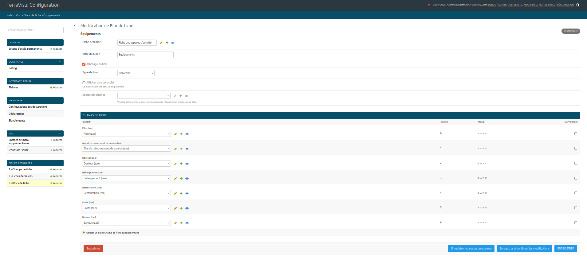

   Édition d'un bloc de type "Booléens"

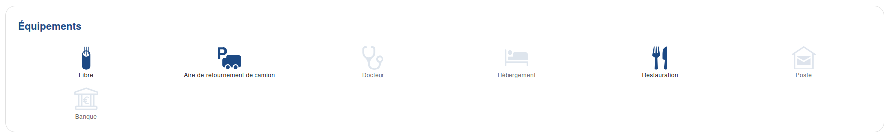

   Rendu du bloc de type "Booléens"

Graphique radar
^^^^^^^^^^^^^^^^

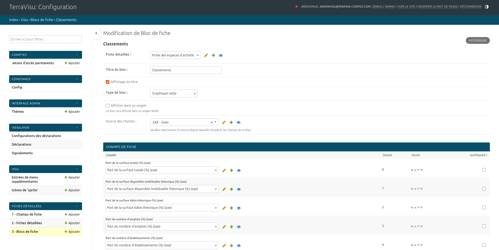

   Édition d'un bloc de type "Graphique radar"

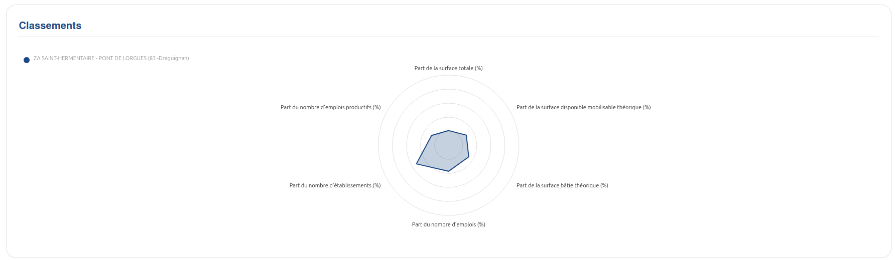

   Rendu du bloc de type "Graphique radar"

Graphique de distribution
^^^^^^^^^^^^^^^^^^^^^^^^^^

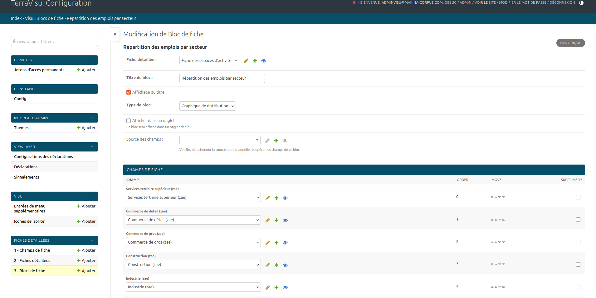

   Édition d'un bloc de type "Graphique de distribution"

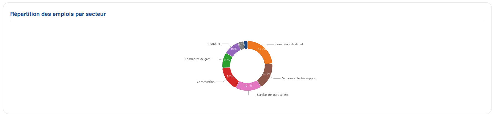

   Rendu du bloc de type "Graphique de distribution"

Graphique en barre
^^^^^^^^^^^^^^^^^^^

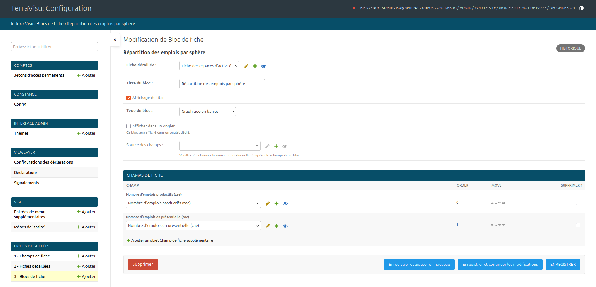

   Édition d'un bloc de type "Graphique en barre"

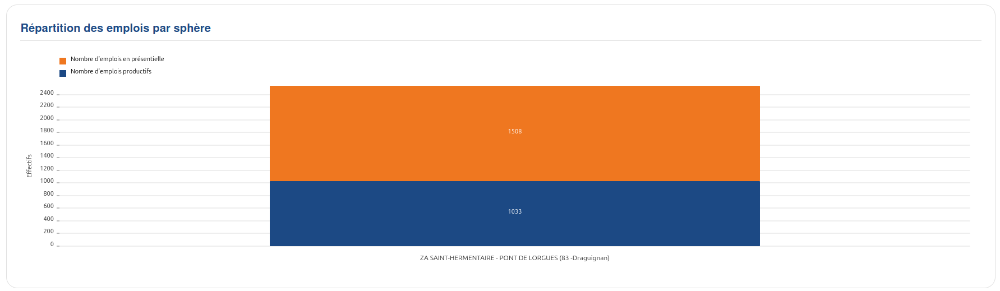

   Rendu du bloc de type "Graphique en barre"

Tableau de champs
^^^^^^^^^^^^^^^^^^

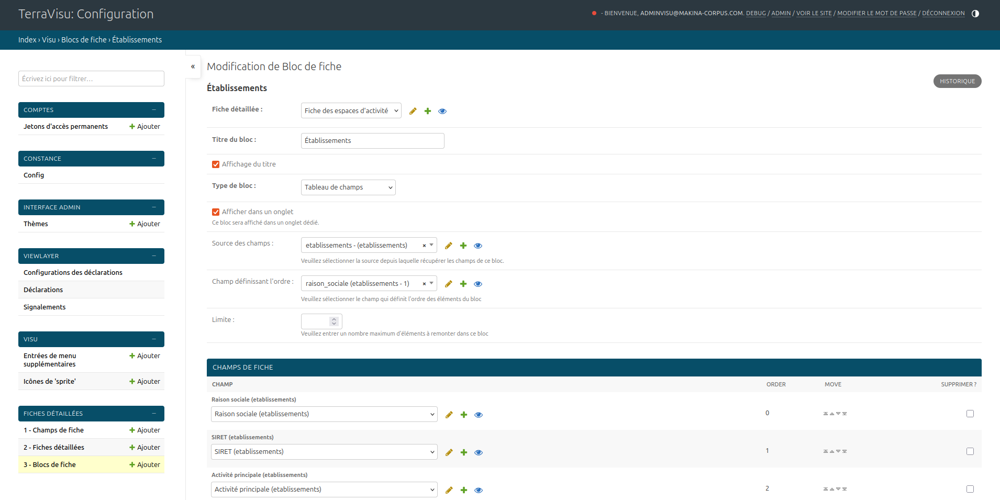

   Édition d'un bloc de type "Tableau de champs"

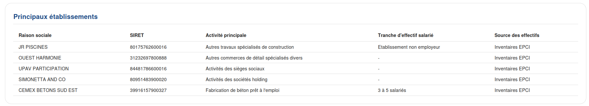

   Rendu du bloc de type "Tableau de champs"

Texte
^^^^^^

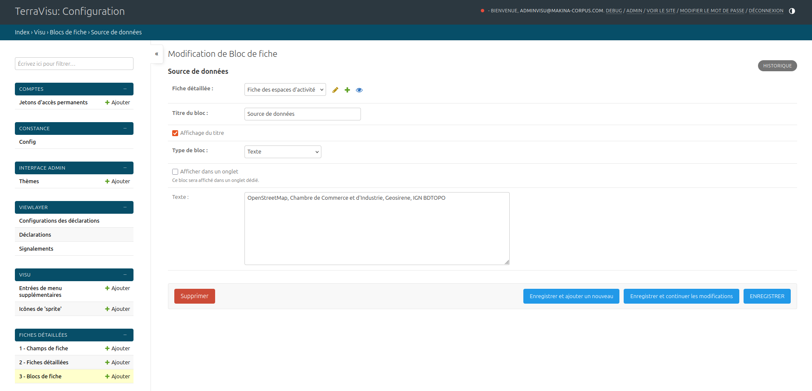

   Édition d'un bloc de type "Texte"

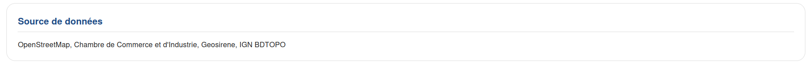

   Rendu du bloc de type "Texte"

