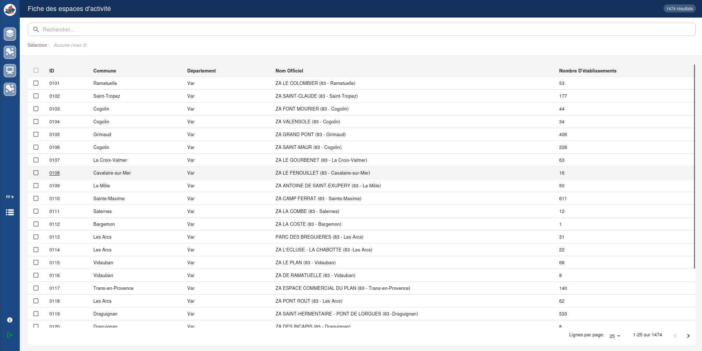
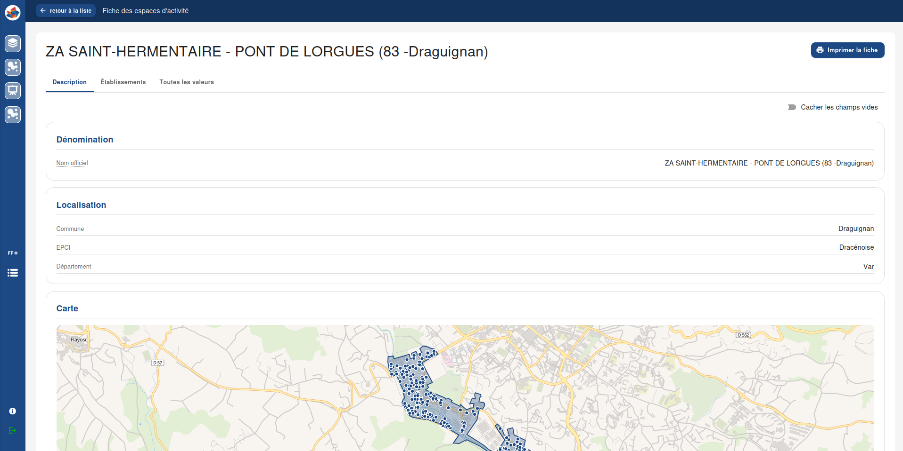
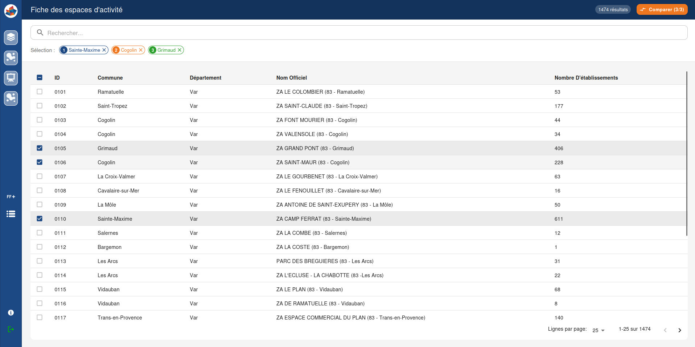
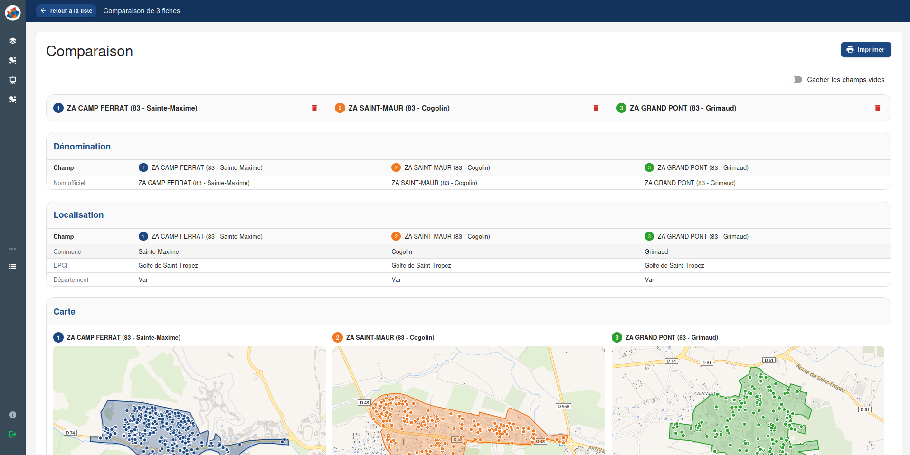
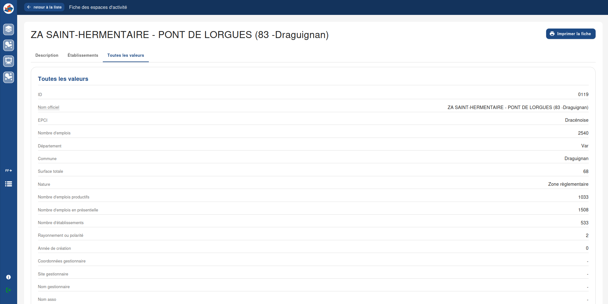
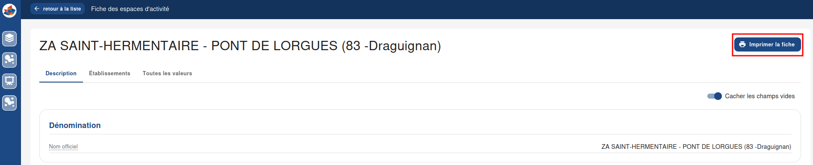
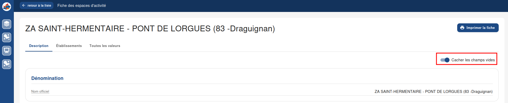

=============================
Module de fiches détaillées
=============================

Explorer les fiches détaillées
===============================

Le module de fiches détaillées permet d'explorer, d'analyser et de comparer les données associées à une entité.

Il est accessible depuis l'URL du visualiseur en ajoutant le suffixe ``/sheet``.

Par exemple :

::

   https://visu.mon-instance.fr/sheet

Les fiches détaillées sont entièrement configurables depuis le `le module de configuration <https://terravisu.readthedocs.io/en/latest/user_manual/module_configuration.html#les-fiches-detaillees>`_.

Liste des fiches
-----------------

La page d'accueil du module affiche la liste des fiches disponibles.

Depuis cette interface, il est possible de :

* trier les colonnes par ordre alphabétique ou numérique ;
* effectuer une recherche dans les colonnes affichées ;
* accéder à une fiche détaillée en cliquant sur le nom d'une entité ;
* sélectionner jusqu'à trois entités afin de comparer leurs données.

   Liste des fiches détaillées.

Consulter une fiche détaillée simple
-------------------------------------

Une fiche détaillée regroupe l'ensemble des informations relatives à une entité.

Selon sa configuration, elle peut contenir différents types de contenus :

* champs descriptifs 
* tableaux de données 
* cartes interactives 
* visualisations immersives Panoramax 
* graphiques statistiques 
* images et médias 
* textes libres

Les informations sont organisées en sections afin de faciliter leur consultation.

Comparer plusieurs entités
---------------------------

Il est possible de sélectionner jusqu'à trois entités dans la liste afin de comparer leurs données côte à côte.

Pour accéder à la page de comparaison :

* Sélectionnez les entités à comparer depuis la liste ou la table attributaire.
* Cliquez sur le bouton **Comparer ces données**.

La comparaison permet d'identifier rapidement les différences et similitudes entre plusieurs entités à travers l'ensemble des informations configurées dans la fiche.

Consulter une fiche détaillée en comparaison
----------------------------------------------

La vue de comparaison affiche les informations de chaque entité côte à côte afin de faciliter l'analyse et l'identification des différences entre elles.

Les différents blocs configurés dans la fiche détaillée sont également disponibles dans la vue de comparaison :

* champs descriptifs 
* indicateurs 
* tableaux 
* cartes 
* graphiques 
* vues Panoramax 
* autres composants personnalisés

Les valeurs de chaque entité sont affichées en colonnes afin de permettre une lecture comparative rapide entre les entités sélectionnées.

Afin d'éviter l'affichage d'informations incomplètes ou non pertinentes, certains blocs peuvent être masqués automatiquement dans la vue de comparaison.

C'est notamment le cas des blocs **Panoramax** : lorsqu'aucune image Panoramax n'est disponible pour l'ensemble des entités comparées, le bloc n'est pas affiché.

À l'inverse, si au moins une des entités dispose d'une image Panoramax, le bloc reste visible dans la comparaison.

Onglets
--------

Afin d'améliorer la lisibilité des fiches les plus riches, certaines sections peuvent être regroupées dans des onglets.

Cette organisation permet notamment de :

* limiter la longueur de la fiche ;
* regrouper des informations thématiques ;
* faciliter la navigation entre les différents jeux de données.

Impression PDF
---------------

Chaque onglet d'une fiche détaillée peut être exporté au format PDF.

Cette fonctionnalité permet de générer rapidement un document imprimable ou partageable contenant les informations affichées dans l'onglet sélectionné.

Masquer les champs vides
-------------------------

Lorsque certaines données ne sont pas renseignées, il est possible d'activer l'option **Cacher les champs vides**.

Cette option masque automatiquement les champs ne contenant aucune valeur afin d'améliorer la lisibilité de la fiche.

