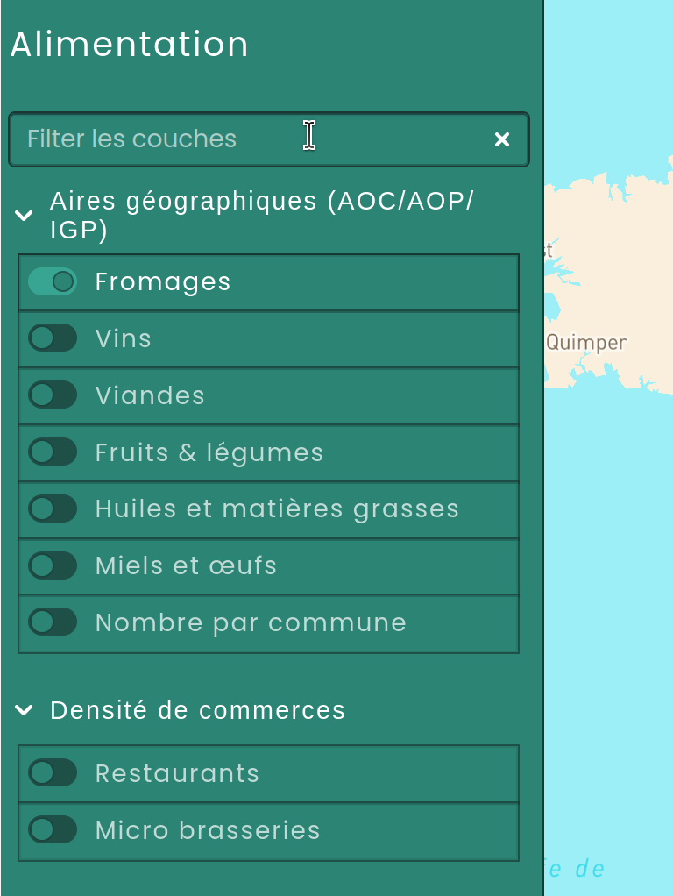
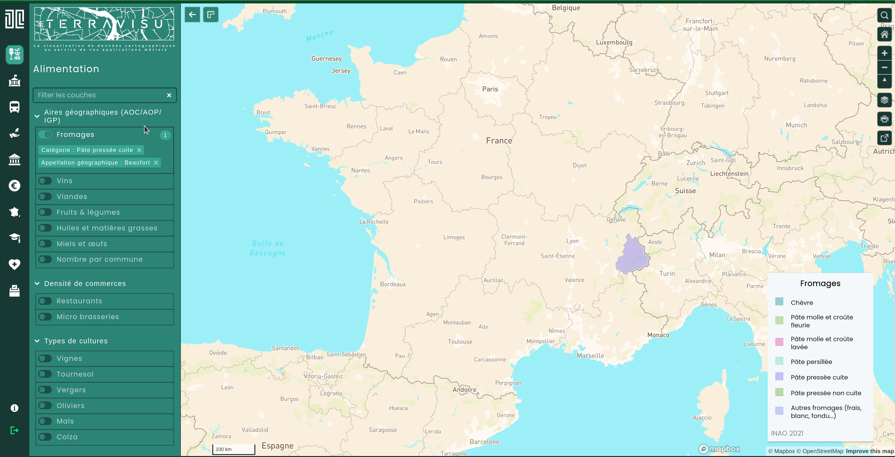

======================
Plateforme TerraVisu 
======================

TerraVisu 
==========

L’application cartographique **TerraVisu** permet de manipuler un ensemble de données relatives aux différents champs de l’action publique : démographie, habitat, patrimoine, mobilité, environnement.

**TerraVisu** propose des outils d’observation et d’analyse pour comprendre l’évolution de vos territoires.

Vous voulez tester par vous-même? `Une instance de démonstration est accessible ici <https://demo-terravisu-territoires.makina-corpus.com/>`_ !

**Résumé des fonctionnalités :**

* Naviguer dans l'interface cartographique
* Intéragir avec les couches (descriptif, filtres, table attributaire, transparence, zoom sur l'emprise, synthèse statistique)
* Interroger les objets géographiques (infobulle au survol, fiche descriptive)
* Afficher des fonds de cartes
* Utiliser les outils de navigation (recherche dans les données/lieux, gestion du zoom, orientation de la carte..) 
* Exporter et partager les cartes (impression PDF, partage de la carte sur les réseaux sociaux)

Les principales fonctionnalités
===============================

L'interface cartographique
------------------------------

L'interface cartographique est décomposée en 4 parties :

* Les vues : à gauche, le panneau des vues permet d'organiser les couches par grande famille ou thématique
* L'arbre des couches : entre les vues et la carte, l'arbre des couches permet d'afficher, de rechercher une couche et de filtrer les données à voir sur la carte
* La carte : au centre, un fond de plan cartographique sur lequel se superposent des données
* Les outils de navigation : à droite, se trouvent les outils incontournables d'une application cartographique (zoom, orientation) mais aussi d'autres outils additionnels comme le retour à l'emprise initiale, le changement de fond de plan, l'impression et le partage de la carte

**Exemple**

.. image :: ../_static/images/visu/visu_interfacecarto.png

Le panneau latéral gauche
~~~~~~~~~~~~~~~~~~~~~~~~~~

Les vues
^^^^^^^^^

Les couches sont réparties dans des vues et reflètent des thématiques ou des applications métier. 

Les vues sont représentées par des pictogrammes dans le bandeau latéral gauche. 

.. image :: ../_static/images/visu/vue.png
  :width: 200

Pour changer de vue, cliquez sur le pictogramme concerné.

.. note::
	Chaque vue est indépendante et il n'est pas possible d'afficher deux vues à la fois. 
	Cela signifie qu'en cliquant sur une autre vue, la carte change.

Les sites externes
^^^^^^^^^^^^^^^^^^

Depuis le panneau latéral des vues, il est possible de rajouter des boutons renvoyant vers des sites externes. Cet ajout est à réaliser dans le module de configuration.

**Exemple de sites externes**

.. image :: ../_static/images/visu/visu_sitesexternes.png

La pop-up Informations
^^^^^^^^^^^^^^^^^^^^^^

**Bouton de la pop-up**

.. image :: ../_static/images/visu/visu_popup_informations_button.png

**Pop-up par défaut**

.. image :: ../_static/images/visu/visu_popup_informations.png

Le bouton de connexion/déconnexion
^^^^^^^^^^^^^^^^^^^^^^^^^^^^^^^^^^^

**Bouton de connexion**

.. image :: ../_static/images/visu/visu_login.png

**Bouton de déconnexion**

.. image :: ../_static/images/visu/visu_logout.png

**Exemple de fenêtre de connexion**

.. image :: ../_static/images/visu/visu_login_popup.png

Les données géographiques
-----------------------------

Les données géographiques sont organisées dans des couches qui rassemblent des entités de même nature. Chaque couche de carte permet d'afficher et d'utiliser un jeu de données SIG spécifique.

**TerraVisu** dispose d'un arbre des couches sur lequel une série d'outils permet d'agir sur les différentes couches de données visibles.

Au niveau d'une couche de données, vous pouvez ainsi activer les fonctionnalités suivantes :

* Afficher/masquer la couche
* Afficher/masquer le panneau d'informations de la couche
* Afficher/masquer la table attributaire
* Afficher/masquer le panneau de filtres
* Afficher/modifier la liste des filtres appliqués
* Afficher le widget de synthèse
* Afficher du contenu provenant d'une application externe (graphiques par exemple)
* Zoomer sur son étendue spatiale
* Changer son opacité

.. image :: ../_static/images/visu/visu_interfacecarto_couche.png
  :width: 300

L'interface cartographique se met automatiquement à jour selon les fonctionnalités activées.

Les données sont agencées de manière personnalisée dans l'arbre des couches. 

Vous pouvez créer autant de grandes catégories et de sous-catégories de groupes de données que vous le souhaitez.

Dans le cas où il y aurait un grand nombre de couches dans l'arbre, vous pouvez utiliser la barre de recherche présente en haut du panneau pour filtrer une couche par son nom.

.. note::
	Le filtrage de couche ne peut se faire que dans la vue en cours.

**Exemple de barre de filtre**

L'affichage de la couche
~~~~~~~~~~~~~~~~~~~~~~~~~

Pour activer/désactiver une couche cliquez sur le curseur à gauche du nom.

La légende
^^^^^^^^^^

Quand les couches affichées ont des légendes, celles-ci s'affichent sur la partie droite de l'écran.

**Exemple de légende disponible**

.. image :: ../_static/images/visu/visu_legende.png
  :width: 200

La configuration de la légende s’effectue depuis l'outil administration.

Le panneau d'informations
~~~~~~~~~~~~~~~~~~~~~~~~~~
Il est possible d'associer du contenu informatif à chaque couche. Ce contenu est mis à disposition de l'utilisateur via un panneau dédié, configurable dans l'interface d'administration de la plateforme **TerraVisu**.

**Exemple de panneau d'informations**

.. image :: ../_static/images/visu/visu_infos.png

La table attributaire
~~~~~~~~~~~~~~~~~~~~~~~

La table attributaire de **TerraVisu** propose les fonctionnalités suivantes :

* Visualiser le nombre total de lignes
* Afficher le nombre de lignes sélectionnées
* Afficher le nombre de lignes filtrées
* Afficher uniquement les lignes sélectionnées
* Zoomer sur l’emprise géographique des entités sélectionnées
* Ouvrir la mini-fiche d’une entité
* Trier les données selon une ou plusieurs colonnes
* Filtrer les données en fonction de l’emprise courante de la carte
* Comparer jusqu’à trois entités sur une vue détaillée
* Exporter les données (formats CSV et Excel)
* Afficher ou masquer des colonnes
* Agrandir ou réduire l’affichage de la table

.. note::
	La table attributaire est synchronisée avec la carte interactive**.
	La sélection d’une entité dans la table entraîne automatiquement :
  * sa mise en évidence sur la carte
  * un recentrage et un zoom sur son emprise

**Exemple d'une table attributaire**

.. image :: ../_static/images/visu/visu_table.png

Une fois la table exportée, vous pouvez travailler vos données avec votre tableur habituel et créer des graphiques, des tableaux dynamiques croisés, etc., depuis votre ordinateur.

Le filtrage des données
~~~~~~~~~~~~~~~~~~~~~~~~~~

Un jeu de données peut être filtré par ses données attributaires, c’est à dire des informations textuelles qui décrivent les caractéristiques diverses (géographiques, alphanumériques, etc.). 

Les éléments qui ne correspondent pas au filtre sont cachés et la carte est alors mise à jour.

**Exemple de filtres disponibles**

.. image :: ../_static/images/visu/visu_filtre.png
  :width: 200

Les filtres peuvent prendre plusieurs formes (case à cocher, intervalle de valeurs, curseur, champ recherche au autocomplétion, etc.) et sont paramétrables dans l'outil d'administration.

Le widget
~~~~~~~~~~~~

Le widget permet de récapituler dans un tableau dynamique, des indicateurs utiles à l'analyse de la couche. La synthèse des informations se réactualise en fonction des éléments qui se trouvent dans l'emprise spatiale. Le widget s’affiche à droite de l’écran.

**Exemple d'un widget**

.. image :: ../_static/images/visu/visu_widget.png
  :width: 300

Les données à afficher dans le widget sont définies par l’utilisateur dans l'outil d'administration.

Le zoom sur l'étendue spatiale
~~~~~~~~~~~~~~~~~~~~~~~~~~~~~~~~~

Cet outil permet de zoomer sur l'étendue spatiale d'une couche activée. Le zoom est particulièrement utile lorsque l'on souhaite voir l'emprise géographique des éléments filtrés d'une couche.

**Exemple d'un zoom**

La modification de l'opacité 
~~~~~~~~~~~~~~~~~~~~~~~~~~~~~~~

Pour changer l'opacité d'une couche, cliquez sur les trois petits points horizontaux à côté de l'outil filtre.

Faites glisser le curseur de droite à gauche pour modifier le pourcentage de transparence.

**Exemple de transparence sur la couche des lignes de bus**

.. image :: ../_static/images/visu/visu_transparence.png
  :width: 300

Les inclusions / contenus externes associés
~~~~~~~~~~~~~~~~~~~~~~~~~~~~~~~~~~~~~~~~~~~~

Des contenus configurés depuis une application externe, notamment des graphiques, peuvent être ajoutés à une couche. Un pictogramme et un libellé, paramétrables depuis l'interface d'administration, permet d'identifier chacun d'entre eux dans la liste des informations et outils disponibles sur la couche.

**Exemple de graphique**

.. image :: ../_static/images/visu/visu_graphique.png

Les intéractions avec les données affichés sur la carte
---------------------------------------------------------

Il est possible d’interagir avec les objets affichés sur la carte, dès lors que les couches ont été configurées dans le backoffice pour inclure les infobulles (survol) ou les mini-fiches (clic).

La fiche descriptive
~~~~~~~~~~~~~~~~~~~~~~~

Les informations relatives aux données sont présentées dans une fiche à droite de l'écran. Cette fiche apparaît **au clic** de l’objet cartographique.

**Exemple de fiche descriptive pour une station du métro toulousain**

.. image :: ../_static/images/visu/visu_minifiche.png
  :width: 300

Depuis l'outil d'administration, vous pouvez personnaliser la fiche de manière avancée, en y intégrant du texte, des images ou des graphiques intéractifs pour enrichir le rendu. 

Il n'y a pas de limite au contenu de la fiche tant que l'information est disponible. La fiche peut contenir des liens vers des sites web et des mails. 

L'infobulle au survol
~~~~~~~~~~~~~~~~~~~~~~~~

Une information résumée de la donnée, sous la forme d'une infobulle, est disponible **au survol** des objets cartographiques. Cette infobulle est configurable depuis l'outil d'administration.

**Exemple d'infobulle sur une station de métro toulousain**

.. image :: ../_static/images/visu/visu_infobulle.png
  :width: 400

Le contenu de l'infobulle est entièrement personnalisable dans l'outil d'administration et peut comprendre toutes les informations que vous souhaitez.

Les outils de navigation standards
-----------------------------------

**TerraVisu** dispose des contrôles classiques de navigation :

* Recherche de lieux/adresse et dans les données actives
* Retour à l'emprise d'origine
* Gestion du zoom
* Réorientation de la carte
* Gestion des fonds de carte
* Impression vers PDF
* Partage de la carte / encapsulation

**Barre de navigation à droite sur la carte**

.. image :: ../_static/images/visu/visu_outilnavigation.png
  :width: 50

Quelques uns de ces outils de navigation sont détaillés ci-après.

La recherche sur la carte
~~~~~~~~~~~~~~~~~~~~~~~~~~~~~

La recherche sur la carte (via l'outil loupe) permet d'effectuer à la fois :

* une recherche de lieu ou d'adresse par à un appel à la base d'adresses Nominatim implémenté,
* une recherche dans les champs textuels d'une ou plusieurs couches activées (exemple : une parcelle par le nom du propriétaire).

Le fait de sélectionner un résultat dans les attributs de la ou les couches activées permet de zoomer sur ce résultat, de sélectionner l'objet en surbrillance et d'ouvrir la mini-fiche (si elle est configurée).

Le comportement est différent si on sélectionne un résultat pour la recherche de lieu puisqu'il permet uniquement de centrer et zoomer sur l'emprise géographique correspondante sans réaliser d'intéraction avec la ou les couches activées.

**Exemple de recherche**

.. image :: ../_static/images/visu/visu_recherche.png

Le retour à l'emprise d'origine
~~~~~~~~~~~~~~~~~~~~~~~~~~~~~~~~~~~

Pour revenir à l'emprise initiale du projet, cliquez sur l'icône en forme de maison.

La gestion du zoom
~~~~~~~~~~~~~~~~~~~~~~

Pour zoomer sur la carte utilisez la molette de la souris vers l'avant ou cliquez sur l'icône :guilabel:`+`.

Pour dézoomer sur la carte utilisez la molette de la souris vers l'arrière ou cliquez sur l'icône :guilabel:`-`.

La réorientation de la carte
~~~~~~~~~~~~~~~~~~~~~~~~~~~~~~~~

Par défaut la carte est orientée au nord. Pour changer l'orientation, cliquez sur l'icône en forme de boussole.

Pour avoir une meilleure expérience utilisateur sur les couches en 3D, effectuez la combinaison :guilabel:`CTRL` + :guilabel:`clic gauche` souris sur la carte pour incliner le plan.

La gestion des fonds de carte
~~~~~~~~~~~~~~~~~~~~~~~~~~~~~~~~~

Plusieurs fonds de cartes sont disponibles par défaut et vos propres fonds de carte peuvent être ajoutés depuis l'`outil d'administration <https://terravisu.readthedocs.io/en/latest/user_manual/admin_user_guide.html#liste-des-fonds-de-carte>`_ 

L'impression de la carte au format PDF
~~~~~~~~~~~~~~~~~~~~~~~~~~~~~~~~~~~~~~~~~~

Le composeur d’impression de TerraVisu permet de générer un export PDF de la carte affichée à l’écran. 

L’outil offre plusieurs options de personnalisation afin d’adapter la mise en page aux besoins de l’utilisateur :

* Choix de la disposition du document (portrait ou paysage)
* Ajout d’un titre dynamique, avec paramétrage de la taille et de l’alignement (gauche, centre, droite)
* Intégration d'un logo dans l’en-tête, avec possibilité de définir sa position (au-dessus, à gauche ou à droite)
* Activation des éléments cartographiques tels que l’échelle et les attributions
* Possibilité de définir des bordures arrondies

**Exemple du composeur d'impression**

.. image :: ../_static/images/visu/visu_impression.png

Le partage de la carte
~~~~~~~~~~~~~~~~~~~~~~~~~~

Le bouton de partage de carte permet :

* de partager un hyperlien avec plusieurs options 
* de générer le code d’une ``iframe``

Lien direct
^^^^^^^^^^^^^

Le partage de lien direct permet de générer un hyperlien avec plusieurs options de partage :

* conserver la position sur la carte 
* conserver les couches activées 
* afficher l’arbre des couches, sinon il sera rétracté 
* conserver le fond de carte utilisé au moment du partage

Une fois les options choisies, l’utilisateur peut cliquer sur :guilabel:`Copier`. Un message :guilabel:`Copié !` s’affiche alors.

**Exemple de partage d'hyperlien**

.. image :: ../_static/images/visu/visu_partage.png

Iframe
^^^^^^^

La génération du code de l’``iframe`` se met à jour en temps réel au fur et à mesure que les options changent.

Il est possible de définir la taille de l’``iframe`` en renseignant sa largeur et sa hauteur.

Le bouton :guilabel:`Prévisualiser` permet d’obtenir un aperçu du rendu de la page TerraVisu qui sera encapsulée dans un site tiers.

**Exemple d'encapsulation**

.. image :: ../_static/images/visu/visu_encapsulation.png

Les outils de navigation optionnels
-----------------------------------

Il est également possible d'activer l'outil de déclaration depuis le module de configuration, afin de permettre aux utilisateurs de faire des remontées d'informations sur la carte.

.. image :: ../_static/images/visu/visu_outilnavigation_declaration.png
  :width: 50

La visualisation en Storytelling
---------------------------------

TerraVisu dispose d'une fonction de Storytelling. C'est une autre forme de visualisation qui est accessible depuis une vue dédiée. Le storytelling comprend du texte et des images qui sont parcourues comme un « slideshow » (diaporama).

Cette fonctionnalité peut servir à la communication ou de manuel d'utilisation.

**Exemple de storytelling**

.. image :: ../_static/images/visu/visu_storytelling.png

